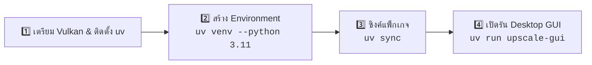

# ⚡ Real-ESRGAN Desktop GUI & Engine

แอปพลิเคชัน Desktop GUI (รองรับ Windows และ Linux) สำหรับขยายความคมชัดของรูปภาพด้วย AI โมเดล **Real-ESRGAN NCNN** พร้อมระบบประมวลผลคู่ **Hybrid GPU + Multi-Core CPU**

---

## 📑 สารบัญ (Table of Contents)

1. [🌟 ฟีเจอร์หลัก (Key Features)](#-ฟีเจอร์หลัก-key-features)
   - [🖥️ Desktop GUI Application (PySide6 / Qt6)](#️-desktop-gui-application-pyside6--qt6)
   - [💻 Headless CLI Engine (upscale.py / upscale-cli)](#-headless-cli-engine-upscalepy--upscale-cli)
2. [🎮 รายการฮาร์ดแวร์ & GPU ที่รองรับ (Supported Hardware & GPUs)](#-รายการฮาร์ดแวร์--gpu-ที่รองรับ-supported-hardware--gpus)
   - [AMD Radeon GPUs](#1--amd-radeon-gpus-รองรับสมบูรณ์แบบ---first-class-support)
   - [NVIDIA GeForce / RTX GPUs](#2--nvidia-geforce--rtx-gpus)
   - [Intel GPUs](#3--intel-gpus)
   - [CPU Mode](#4-⚡-cpu-multi-threading-mode-ไม่จำเป็นต้องมี-gpu)
3. [🚀 คู่มือการติดตั้งและเปิดใช้งาน Desktop GUI (Quick Start & GUI Setup)](#-คู่มือการติดตั้งและเปิดใช้งาน-desktop-gui-quick-start--gui-setup)
   - [สรุปคำสั่งแบบด่วน (Quick Start Cheat Sheet)](#สรุปคำสั่งแบบด่วน-quick-start-cheat-sheet)
   - [Step 1: ตรวจสอบและติดตั้ง Driver Vulkan + เครื่องมือ uv](#step-1-ตรวจสอบและติดตั้ง-driver-vulkan--เครื่องมือ-uv)
   - [Step 2: เตรียม Python 3.11 และสร้าง uv venv](#step-2-เตรียม-python-311-และสร้าง-uv-venv)
   - [Step 3: ติดตั้ง Dependencies ด้วย uv sync](#step-3-ติดตั้ง-dependencies-ด้วย-uv-sync)
   - [Step 4: รัน Desktop GUI ด้วย uv run](#step-4-รัน-desktop-gui-ด้วย-uv-run)
   - [Step 5: การใช้งานและการปรับแต่งในหน้า GUI](#step-5-การใช้งานและการปรับแต่งในหน้า-gui)
4. [💻 คู่มือการใช้งาน CLI Version (upscale.py / upscale-cli)](#-คู่มือการใช้งาน-cli-version-upscalepy--upscale-cli)
   - [1. โครงสร้างคำสั่งพื้นฐาน (Basic Syntax)](#1-โครงสร้างคำสั่งพื้นฐาน-basic-syntax)
   - [2. ตารางพารามิเตอร์ทั้งหมด (Command Options)](#2-ตารางพารามิเตอร์ทั้งหมด-command-options)
   - [3. คุณสมบัติของแต่ละโมเดล (Model Comparison)](#3-คุณสมบัติของแต่ละโมเดล-model-comparison)
   - [4. แหล่งจัดเก็บโมเดลและการค้นหา Path (AI Model Storage & Search Paths)](#4-แหล่งจัดเก็บโมเดลและการค้นหา-path-ai-model-storage--search-paths)
   - [5. ตัวอย่างคำสั่งที่ใช้บ่อย (Cheat Sheet: Common Use Cases)](#5-ตัวอย่างคำสั่งที่ใช้บ่อย-cheat-sheet-common-use-cases)
   - [6. การตรวจสอบประสิทธิภาพการทำงาน (Performance Monitoring)](#6-การตรวจสอบประสิทธิภาพการทำงาน-performance-monitoring)
5. [🧪 การทดสอบระบบ (Automated Tests & Quality Gates)](#-การทดสอบระบบ-automated-tests--quality-gates)
6. [📦 การสร้างไฟล์ติดตั้ง (Cross-Platform Standalone Build)](#-การสร้างไฟล์ติดตั้ง-cross-platform-standalone-build)
   - [บน Windows](#บน-windows)
   - [บน Linux](#บน-linux)
   - [สร้างอัตโนมัติผ่าน GitHub Actions CI](#สร้างอัตโนมัติผ่าน-github-actions-ci)
7. [📁 โครงสร้างโปรเจกต์ (Project Architecture)](#-โครงสร้างโปรเจกต์-project-architecture)
8. [📄 License](#-license)

---

## 🌟 ฟีเจอร์หลัก (Key Features)

### 🖥️ Desktop GUI Application (PySide6 / Qt6)
- **🎯 1-Click Photography Presets**: ปรับแต่งค่าอัตโนมัติตามประเภทภาพในคลิกเดียว (Portrait & Studio, Old Film Scan, Landscape, Anime, Low-Light)
- **Drag & Drop & Recursive Batch Queue**: ลากวางไฟล์รูปภาพ หรือกดปุ่ม `📂 Add Folder` เพื่อสแกนค้นหารูปภาพในทุกโฟลเดอร์ย่อยอย่างลึกซึ้ง (`rglob("*")`) พร้อมระบบตรวจจับและป้องกันไฟล์ชื่อซ้ำเขียนทับกันอัตโนมัติ (Collision Protection: `photo_x4.png`, `photo_1_x4.png`)
- **🎯 5-Column Queue & Bulk Destination**: ตารางคิวงานแสดง 5 คอลัมน์ (`#`, `Name`, `Resolution`, `Destination`, `Status`) รองรับการเลือกหลายไฟล์แล้วคลิกขวาเปลี่ยนโฟลเดอร์ปลายทางพร้อมกัน, กดปุ่ม `📁 Destination` บน Toolbar, หรือดับเบิ้ลคลิกช่อง Destination ได้อย่างอิสระ
- **💾 Save & Multi-Queue Session Load (.json)**: บันทึกและโหลดคิวงานเก็บไว้ทำต่อ พร้อมรองรับการเลือกโหลดหลายไฟล์ `.json` พร้อมกันในครั้งเดียว (Multi-File Selection) พร้อมตัวเลือก Append เข้ากับคิวเดิม หรือ Replace คิวใหม่
- **🛡️ Destination Fallback Across PCs**: เมื่อนำไฟล์ Session ไปเปิดบนเครื่องอื่นหรือไดรฟ์ที่ไม่มีอยู่จริง ระบบจะสลับมาใช้ Output Directory ปัจจุบันของโปรแกรมอัตโนมัติ ปลอดภัย ไม่เกิดข้อผิดพลาด
- **🔄 Auto-Save & Crash Recovery**: จดจำรายการคิวและสถานะล่าสุด (`Done`, `Queued`, `Failed`) อัตโนมัติเมื่อปิดหรือเปิดโปรแกรมใหม่
- **⏩ Smart Resume & Context Menu**: เมื่อกด Start Batch ระบบจะประมวลผลต่อเฉพาะไฟล์ที่ยังไม่เสร็จ และข้ามไฟล์ที่เสร็จแล้วอัตโนมัติ พร้อมเมนูคลิกขวา: `🔄 Retry Failed Items`, `🧹 Clear Completed`, `↺ Reset All to Queued`
- **🔍 Interactive Zoom & Pan Before/After Wiper**: ตัวเลื่อนเปรียบเทียบภาพแบบ Split-View Slider พร้อมระบบซูมด้วยล้อเมาส์ (1.0x – 8.0x), คลิกขวา/เมาส์กลางลากเพื่อ Pan, และดับเบิ้ลคลิกเพื่อรีเซ็ต
- **⚡ Smart Instant Preview**: กดปุ่ม Generate Preview เพื่อดูผลลัพธ์โมเดลแบบทันทีและบันทึกลงโฟลเดอร์ผลลัพธ์จริง พร้อมสตรีม Progress การดาวน์โหลดโมเดลเข้าหน้าต่าง Log
- **🌓 Dynamic Theme Switcher**: สลับโหมด Dark Mode (Cyberpunk Dark) และ Light Mode (Clean Slate Light) ได้ทันทีแบบ Real-Time พร้อมจดจำสถานะ
- **🤖 โมเดล AI ครบวงจร (Default: `x4plus` 4x)**:
  - `x4plus` (ค่าเริ่มต้น): โมเดลคุณภาพสูงสุด เก็บรายละเอียดพื้นผิว Texture ภาพถ่าย ทิวทัศน์ บุคคล
  - `x4plus-anime`: ลายเส้นคมกริบ สำหรับงานดิจิทัลอาร์ตและการ์ตูน 4K
  - `animevideov3`: ความเร็วสูงสุด เหมาะกับภาพอนิเมะ การ์ตูน สกรีนช็อต (Native 2x)
- **👤 Face Enhancement (GFPGAN / CodeFormer ONNX)**: กู้คืนรายละเอียดดวงตา ผิว ฟัน และโครงหน้ามนุษย์ด้วย AI (Default: GFPGAN v1.4 ตรึงพิกัดตาแม่นยำ ไร้ปัญหาตาซ้อน) ทำงานผ่าน ONNX Runtime น้ำหนักเบา
- **👄 Preserve Real Smile (มาสก์ฟัน & รอยยิ้มเดิม)**: ระบบ Selective Feature Masking ช่วยเบลนด์ฟันและริมฝีปากจริงของภาพเดิมกลับลงไปอย่างแนบเนียน กำจัดอาการฟันเกิน ฟันหลอกตา (AI Hallucination) และรอยยิ้มปลอม 100% ขณะที่ผิวหน้าและดวงตายังคงคมชัดระดับสตูดิโอ (เปิดอัตโนมัติใน Preset `portrait`)
- **🎞️ Natural Monochromatic Film Grain (0–10%)**: เติมเกรนฟิล์ม 35mm อิงความสว่าง Midtones กำจัดอาการผิวหุ่นขี้ผึ้ง (Waxy Skin) คืนชีวิตชีวาและ Micro-contrast ให้ผิวสมจริง
- **📷 EXIF Metadata & ICC Profile Preservation**: ถ่ายโอนข้อมูลกล้อง เลนส์ วันที่ ค่าเปิดรับแสง และ Color Profile (sRGB, Display P3, Adobe RGB) จากภาพต้นฉบับไปยังไฟล์ผลลัพธ์ 100%
- **🧹 Denoise & Natural Grain Preservation**: แถบเลื่อนปรับระดับลด Noise (0–100) ค่าเริ่มต้น 0% เพื่อรักษา Texture ตามธรรมชาติของผิวมนุษย์
- **⚙️ ควบคุมฮาร์ดแวร์อิสระ**:
  - เลือกเปิด/ปิด GPU Worker (Vulkan Device 0: เช่น AMD Radeon, NVIDIA GeForce, Intel Arc)
  - ปรับจำนวน CPU Workers ได้ตามจำนวน Core ของเครื่อง (เช่น AMD Ryzen 4500 = 3 Workers)
  - ปรับขนาด Tile Size (0 = Auto/เร็วสุด, 200-400 = ประหยัด VRAM 2GB)
- **📊 Real-Time Telemetry**: แสดงแถบความคืบหน้า, ความเร็วประมวลผล (Images/sec), เวลาที่เหลือโดยประมาณ (ETA), และ Console แสดง Log แบบแบ่งสี
- **⏹️ Cooperative Cancellation**: ปุ่มยกเลิก (Cancel) หยุดการทำงานของ Worker Processes ได้อย่างปลอดภัยโดยไม่มี Process ค้าง

### 💻 Headless CLI Engine (`upscale.py` / `upscale-cli`)
- เข้ากันได้ 100% (Backward-Compatible) กับคำสั่งสคริปต์เดิม
- รองรับการเรียกใช้ผ่าน Terminal, Cron Job หรือ Automated Pipeline ได้ตามปกติ
- บังคับรันบนสภาพแวดล้อม Python 3.11 เสถียรสูง

---

## 🎮 รายการฮาร์ดแวร์ & GPU ที่รองรับ (Supported Hardware & GPUs)

โปรเจกต์นี้ใช้ **Vulkan API** ร่วมกับเอนจิน **Tencent NCNN** เป็นแกนหลัก จึงรองรับการ์ดจอจาก **ทุกค่าย (Cross-Vendor)** ได้อย่างสมบูรณ์ ไม่ได้จำกัดเฉพาะค่ายใดค่ายหนึ่ง (ไม่ต้องพึ่งพา CUDA):

### 1. 🔴 AMD Radeon GPUs (รองรับสมบูรณ์แบบ - First-Class Support)
* **การ์ดจอแยก (Dedicated Desktop & Laptop GPUs)**:
  * AMD Radeon RX 400 / 500 ซีรีส์ (สถาปัตยกรรม Polaris เช่น RX 480, RX 570, RX 580)
  * AMD Radeon RX Vega ซีรีส์ (Vega 56, Vega 64, Radeon VII)
  * AMD Radeon RX 5000 ซีรีส์ (RDNA 1 เช่น RX 5500 XT, RX 5600 XT, RX 5700 XT)
  * AMD Radeon RX 6000 ซีรีส์ (RDNA 2 เช่น RX 6600, RX 6700 XT, RX 6800 XT, RX 6900 XT)
  * AMD Radeon RX 7000 ซีรีส์ (RDNA 3 เช่น RX 7600, RX 7700 XT, RX 7800 XT, RX 7900 XTX)
* **การ์ดจอออนบอร์ด (Integrated Graphics / APU)**:
  * AMD Radeon Graphics ในโปรเซสเซอร์ AMD Ryzen APU (เช่น Ryzen 4000, 5000, 6000, 7000, และ 8000 series)

### 2. 🟢 NVIDIA GeForce / RTX GPUs
* **GeForce GTX ซีรีส์**: GTX 900, GTX 1000 (เช่น GTX 1050 2GB, GTX 1060, GTX 1080), GTX 1600 (เช่น GTX 1650, GTX 1660 Super)
* **GeForce RTX ซีรีส์**: RTX 2000, RTX 3000, RTX 4000 ทุกรุ่น

### 3. 🔵 Intel GPUs
* **Intel Arc Discrete GPUs**: Arc A310, A380, A580, A750, A770
* **Intel Integrated Graphics**: Intel Iris Xe, Intel UHD Graphics 620/630/770 ขึ้นไป

### 4. ⚡ CPU Multi-Threading Mode (ไม่จำเป็นต้องมี GPU)
* ซีพียู **AMD Ryzen / Intel Core / Xeon** ทุกรุ่นผ่าน OpenMP Multi-threading ทำงานร่วมกับ GPU หรือทำงานเดี่ยวได้ 100% เหมาะสำหรับเครื่องที่ไม่มีการ์ดจอแยก หรือรันบนคลาวด์/เซิร์ฟเวอร์

---

## 🚀 คู่มือการติดตั้งและเปิดใช้งาน Desktop GUI (Quick Start & GUI Setup)

โปรเจกต์นี้รองรับการจัดการสภาพแวดล้อมและแพ็กเกจด้วย **[uv](https://docs.astral.sh/uv/)** ซึ่งเป็น Python Package Manager ยุคใหม่ที่ทำงานได้เร็วและแม่นยำสูง โดยโปรเจกต์ถูกล็อกเวอร์ชัน Python ไว้ที่ **Python 3.11** เพื่อความเข้ากันได้สูงสุดกับเอนจิน NCNN และ PySide6

### สรุปคำสั่งแบบด่วน (Quick Start Cheat Sheet)



| ขั้นตอน | 🪟 Windows (PowerShell / CMD) | 🐧 Linux (Bash / Zsh) |
| :--- | :--- | :--- |
| **1. ติดตั้ง uv** | `irm https://astral.sh/uv/install.ps1 \| iex` | `curl -LsSf https://astral.sh/uv/install.sh \| sh` |
| **2. สร้าง venv** | `uv venv --python 3.11` | `uv venv --python 3.11` |
| **3. ซิงค์แพ็กเกจ** | `uv sync` | `uv sync` |
| **4. เปิดรัน GUI** | `uv run upscale-gui` | `uv run upscale-gui` |

---

### Step 1: ตรวจสอบและติดตั้ง Driver Vulkan + เครื่องมือ uv

#### 1.1 ตรวจสอบไดรเวอร์การ์ดจอ (Vulkan Driver)
โปรเจกต์นี้ทำงานผ่าน Vulkan API จึงจำเป็นต้องมีไดรเวอร์ Vulkan ในระบบ:

* 🪟 **บน Windows (10 / 11)**:
  * **AMD Radeon**: ติดตั้งไดรเวอร์ [AMD Software: Adrenalin Edition](https://www.amd.com/en/support)
  * **NVIDIA GeForce/RTX**: ติดตั้งไดรเวอร์ [GeForce Game Ready / Studio Driver](https://www.nvidia.com/Download/index.aspx)
  * **Intel Arc / Iris Xe**: ติดตั้งไดรเวอร์ [Intel Graphics Driver](https://www.intel.com/content/www/us/en/download-center/home.html)
  *(ไดรเวอร์ทางการของทั้ง 3 ค่ายจะมี Vulkan Runtime ติดตั้งมาพร้อมแล้ว ใช้งานได้ทันที)*

* 🐧 **บน Linux**:
  * **Arch Linux / Manjaro**:
    ```bash
    # สำหรับ AMD Radeon:
    sudo pacman -S vulkan-radeon vulkan-icd-loader openmp

    # สำหรับ NVIDIA:
    sudo pacman -S nvidia-utils vulkan-icd-loader openmp

    # สำหรับ Intel Arc / UHD:
    sudo pacman -S vulkan-intel vulkan-icd-loader openmp

    # ตรวจสอบว่าระบบมองเห็นการ์ดจอผ่าน Vulkan:
    vulkaninfo --summary
    ```
    > [!NOTE]
    > หากพบปัญหาเกี่ยวกับไลบรารี `libomp.so.5` บน Arch Linux ให้ทำ symlink เชื่อมโยงในระบบ:
    > ```bash
    > sudo ln -s /usr/lib/libomp.so /usr/lib/libomp.so.5
    > sudo ldconfig
    > ```
  * **Ubuntu / Debian / Pop!_OS**:
    ```bash
    # AMD หรือ Intel:
    sudo apt update && sudo apt install -y libvulkan1 mesa-vulkan-drivers vulkan-tools libomp-dev

    # NVIDIA:
    sudo apt update && sudo apt install -y libvulkan1 nvidia-driver-535 libomp-dev
    ```

#### 1.2 ติดตั้งเครื่องมือ `uv` (หากยังไม่มีในเครื่อง)
* 🪟 **Windows (PowerShell)**:
  ```powershell
  powershell -ExecutionPolicy ByPass -c "irm https://astral.sh/uv/install.ps1 | iex"
  ```
  *(หรือติดตั้งผ่าน winget: `winget install --id=astral-sh.uv`)*

* 🐧 **Linux**:
  ```bash
  curl -LsSf https://astral.sh/uv/install.sh | sh
  ```

---

### Step 2: เตรียม Python 3.11 และสร้าง `uv venv`

เพื่อให้มั่นใจว่าแพ็กเกจ `realesrgan-ncnn-py` และไบนารี C++ ทำงานได้อย่างมีเสถียรภาพสูงสุด ให้ใช้ `uv` ติดตั้งและล็อก Runtime ไว้ที่ **Python 3.11**:

#### 2.1 ดาวน์โหลดตัวแปลภาษา Python 3.11 ผ่าน uv
```bash
uv python install 3.11
```

#### 2.2 สั่งสร้าง Virtual Environment ด้วย `uv venv`
```bash
# รันคำสั่งนี้ที่โฟลเดอร์รากของโปรเจกต์ (ImgUpRest)
uv venv --python 3.11
```
คำสั่งนี้จะสร้างโฟลเดอร์สภาพแวดล้อมเสมือน `.venv/` ที่ติดตั้ง Python 3.11 ให้โดยอัตโนมัติ

#### 2.3 (ทางเลือก) การ Activate Environment
> [!TIP]
> เมื่อใช้งาน `uv` ท่าน**ไม่จำเป็นต้องกด activate ก็ได้** เพราะคำสั่ง `uv run` จะเลือกใช้สภาพแวดล้อมใน `.venv/` อัตโนมัติ  
> แต่หากต้องการ Activate เพื่อใช้งานแบบ Virtualenv ดั้งเดิม สามารถทำได้ดังนี้:

* 🪟 **บน Windows**:
  * **PowerShell**:
    ```powershell
    .venv\Scripts\Activate.ps1
    ```
  * **Command Prompt (CMD)**:
    ```cmd
    .venv\Scripts\activate.bat
    ```
* 🐧 **บน Linux**:
  ```bash
  source .venv/bin/activate
  ```

---

### Step 3: ติดตั้ง Dependencies ด้วย `uv sync`

หลังจากสร้าง `.venv` เรียบร้อยแล้ว ให้สั่ง `uv sync` เพื่อติดตั้งไลบรารีทั้งหมด (PySide6, realesrgan-ncnn-py, OpenCV, Pillow, ONNX Runtime ฯลฯ) ให้ตรงตามไฟล์ `uv.lock` อย่างสมบูรณ์:

#### คำสั่งสำหรับผู้ใช้งานทั่วไป (Standard Setup):
```bash
uv sync
```
`uv sync` จะอ่านการตั้งค่าจาก `pyproject.toml` และ `uv.lock` พร้อมติดตั้งโปรเจกต์ในโหมด Editable เข้าไปใน `.venv` ภายในเวลาเพียงไม่กี่วินาที

#### คำสั่งสำหรับนักพัฒนาหรือผู้ที่ต้องการรันการทดสอบ/Build ไฟล์ติดตั้ง (Dev Setup):
```bash
uv sync --extra dev
```
*(จะติดตั้งแพ็กเกจเสริมสำหรับนักพัฒนาเพิ่มเติม ได้แก่ `pytest`, `pytest-mock`, `ruff`, `pyinstaller`, `nuitka`)*

---

### Step 4: รัน Desktop GUI ด้วย `uv run`

เมื่อซิงค์แพ็กเกจเสร็จสิ้น สามารถเปิดใช้งาน Desktop GUI Application ได้ทันทีด้วยคำสั่ง:

#### 🌟 วิธีที่ 1: เปิดผ่าน Entry Point Script (แนะนำ สะดวกที่สุด)
```bash
uv run upscale-gui
```

#### 🌟 วิธีที่ 2: เปิดผ่าน Python Module
```bash
uv run python -m src.gui.app
```

#### 🌟 วิธีที่ 3: กรณีที่สั่ง Activate Virtualenv ไว้อยู่แล้ว
* 🪟 **บน Windows (เมื่อมี `(.venv)` หน้าบรรทัดคำสั่ง)**:
  ```cmd
  upscale-gui
  ```
* 🐧 **บน Linux (เมื่อมี `(.venv)` หน้าบรรทัดคำสั่ง)**:
  ```bash
  upscale-gui
  ```

---

### Step 5: การใช้งานและการปรับแต่งในหน้า GUI

เมื่อหน้าต่างแอปพลิเคชันเปิดขึ้นมา ท่านสามารถเริ่มขยายความคมชัดรูปภาพได้ทันที:

1. **เพิ่มไฟล์รูปภาพ**: ลากไฟล์รูปภาพหรือโฟลเดอร์มาวางในตาราง หรือกดปุ่ม `📂 Add Files` / `📁 Add Folder`
2. **เลือกพรีเซ็ตสำเร็จรูป (1-Click Presets)**:
   - **Portrait & Studio**: เปิด Face Enhancement (GFPGAN) + Preserve Real Smile (ป้องกันฟันเพี้ยน) + เกรนธรรมชาติ 2%
   - **Old Film Scan**: กู้คืนรูปถ่ายเก่า เติมเกรน 35mm ดั้งเดิม 4%
   - **Landscape**: คมชัดสูง ปิดการแต่งหน้า เพื่อเก็บ Texture ของใบไม้ หิน และธรรมชาติ
   - **Anime / Artwork**: เส้นคมกริบ สีสดใส ไร้รอยแตก
   - **Low-Light / Grainy**: ลดจุดรบกวนแสงน้อย ปรับเกรนให้นุ่มนวล
3. **กำหนดการทำงานคู่ขนาน (Hybrid GPU + CPU Concurrency)**:
   - ติ๊กถูก **Enable GPU Worker (Device 0: Vulkan)** เพื่อใช้การ์ดจอ
   - ปรับจำนวน **CPU Workers** (เช่น 3 Workers สำหรับ CPU 6 Cores) เพื่อให้ CPU ช่วยประมวลผลคู่ขนานกับ GPU
4. **กดปุ่ม `🚀 Start Batch Processing`** เพื่อเริ่มการขยายภาพ
5. **สลับธีมหน้าต่าง**: กดปุ่มสลับธีมมุมขวาบนเพื่อสลับระหว่าง **Dark Mode** และ **Light Mode** ได้อย่างลื่นไหล

---

## 💻 คู่มือการใช้งาน CLI Version (`upscale.py` / `upscale-cli`)

สำหรับผู้ใช้งานบน Server ไร้หน้าจอ (Headless), ระบบ Cron Job, หรือสคริปต์อัตโนมัติ สามารถสั่งการผ่าน Command Line ได้ทันที:

### 1. โครงสร้างคำสั่งพื้นฐาน (Basic Syntax)

สั่งรันผ่าน `uv run upscale-cli`:
```bash
uv run upscale-cli -i <INPUT_DIR> -o <OUTPUT_DIR> [OPTIONS]
```

หรือสั่งรันผ่าน `uv run python upscale.py`:
```bash
uv run python upscale.py -i <INPUT_DIR> -o <OUTPUT_DIR> [OPTIONS]
```

---

### 2. ตารางพารามิเตอร์ทั้งหมด (Command Options)

| Flag | Long Option | Type | Default | Description |
| :---: | :--- | :---: | :---: | :--- |
| `-i` | `--input_dir` | `str` | *(Required)* | โฟลเดอร์รูปภาพต้นทางที่ต้องการแปลง |
| `-o` | `--output_dir` | `str` | *(Required)* | โฟลเดอร์ปลายทางสำหรับบันทึกผลลัพธ์ |
| `-p` | `--preset` | `str` | `None` | 1-Click Preset: `portrait`, `vintage_film`, `landscape`, `anime`, `low_light` |
| `-s` | `--scale` | `int` | `4` | อัตราขยายภาพ: `2` หรือ `4` (Default: `4`) |
| `-m` | `--model` | `str` | `x4plus` | โมเดล AI: `x4plus`, `x4plus-anime`, `animevideov3` |
| `-t` | `--tile_size` | `int` | `0` | ขนาดบล็อกประมวลผล (`0` = ทั้งภาพเร็วสุด, `200-400` = ประหยัด VRAM) |
| `-q` | `--quality` | `int` | `92` | คุณภาพไฟล์ผลลัพธ์ JPG ระดับ `1-100` (Default: `92`) |
| `-c` | `--cpu_workers` | `int` | `3` | จำนวน Worker ฝั่ง CPU (แนะนำ: `3` สำหรับ 6-core) |
| `-d` | `--denoise` | `int` | `0` | ระดับลด Noise `0-100` (Default: `0` เพื่อคงเกรนและผิวธรรมชาติ) |
| `-g` | `--grain` | `int` | `0` | ระดับเกรนฟิล์ม 35mm `0-10` (Default: `0` ปิด, แนะนำ `2-3` สำหรับคน) |
| `-f` | `--face_enhance` | - | `False` | เปิดใช้งาน AI Face Enhancement (GFPGAN / CodeFormer) |
| | `--face_model` | `str` | `gfpgan` | เลือกรุ่นโมเดลหน้า: `gfpgan`, `codeformer` (Default: `gfpgan`) |
| | `--face_fidelity` | `float` | `0.8` | ค่าน้ำหนักความสมดุลใบหน้าเดิม `0.0 - 1.0` (Default: `0.8`) |
| `-mm` | `--mask_mouth` | - | `False` | มาสก์ฟันและรอยยิ้มเดิม (Preserve Real Smile) ป้องกันฟันเกิน/รอยยิ้มเพี้ยน |
| `-h` | `--help` | - | - | แสดงข้อความช่วยเหลือและพารามิเตอร์ทั้งหมด |

> [!TIP]
> 📖 **คู่มือทฤษฎีการถ่ายภาพและการปรับค่าเชิงลึก**: ดูคำแนะนำการปรับค่าสำหรับภาพบุคคล ภาพฟิล์มเก่า ภาพวิว และภาพการ์ตูน พร้อมคำอธิบายในแง่ทฤษฎีการถ่ายภาพ (Film Grain, Acutance, Plastic Skin) ได้ที่ [**Manual.md**](Manual.md)

---

### 3. คุณสมบัติของแต่ละโมเดล (Model Comparison)

1. **`x4plus` (Native 4x) — ค่าเริ่มต้น (Default)**
   - **ความเร็ว**: ปานกลาง
   - **คุณภาพ**: สูงสุด เก็บรายละเอียดพื้นผิว (Texture) และดีเทลขนาดเล็กได้สมบูรณ์แบบ
   - **การใช้งานที่แนะนำ**: เหมาะสำหรับภาพถ่ายทั่วไป วิวทิวทัศน์ ภาพบุคคล และภาพถ่ายจริง

2. **`x4plus-anime` (Native 4x)**
   - **ความเร็ว**: ปานกลาง
   - **คุณภาพ**: สูงมาก ลายเส้นคมกริบ ไร้รอยแตกหรือ noise
   - **การใช้งานที่แนะนำ**: เหมาะสำหรับภาพวาดดิจิทัล ภาพการ์ตูน ภาพ 2D อาร์ตเวิร์กที่ต้องการขยายเป็น 4K

3. **`animevideov3` (Native 2x)**
   - **ความเร็ว**: เร็วที่สุด (ประหยัดทรัพยากร GPU/CPU มากที่สุด)
   - **คุณภาพ**: คมชัด เหมาะสำหรับอนิเมะ การ์ตูน สกรีนช็อต
   - **การใช้งานที่แนะนำ**: เหมาะกับงานที่ต้องการประมวลผลปริมาณมากด้วยความเร็วสูง

---

### 4. แหล่งจัดเก็บโมเดลและการค้นหา Path (AI Model Storage & Search Paths)

โมเดลที่ใช้งานในระบบแบ่งออกเป็น 2 ประเภท:
1. **Real-ESRGAN Core Models (`x4plus`, `x4plus-anime`, `animevideov3`)**: ติดตั้งมาพร้อมกับแพ็กเกจ `realesrgan-ncnn-py` โดยตรง สามารถเรียกใช้งานได้ทันทีโดยไม่ต้องดาวน์โหลดเพิ่ม
2. **Face Enhancement Models (`CodeFormer`, `GFPGAN`, `YuNet Face Detector`)**: เป็นโมเดล ONNX สำหรับกู้คืนใบหน้า (~228KB ถึง ~376MB) โปรแกรมจะดาวน์โหลดอัตโนมัติเมื่อเปิดใช้งานครั้งแรก

#### 📍 ลำดับการตรวจสอบและค้นหาไฟล์โมเดล (Search Hierarchy)
เมื่อเปิดใช้งาน Face Enhancement ระบบจะค้นหาไฟล์โมเดลเรียงตามลำดับความสำคัญดังนี้:

| ลำดับ | ตำแหน่งที่ระบบเข้าไปตรวจสอบ | คำอธิบายและวัตถุประสงค์ |
| :---: | :--- | :--- |
| **1** | **Explicit Custom Directory** | โฟลเดอร์ที่ส่งผ่านโค้ดหรือพารามิเตอร์ `custom_dir` |
| **2** | **Environment Variable** (`$REAL_ESRGAN_WEIGHTS_DIR`) | สำหรับผู้ใช้ที่ต้องการย้ายโมเดลไปไว้ที่ไดรฟ์อื่น เช่น External SSD หรือไดรฟ์ D: |
| **3** | **Standalone / Portable Mode** (`<exe_dir>/weights`) | ตรวจสอบโฟลเดอร์ `weights/` ข้างไฟล์ `.exe` สำหรับรันแบบพกพาใส่ Flash Drive |
| **4** | **Project / Working Directory** (`./weights` หรือ `./models`) | ตรวจสอบโฟลเดอร์ภายในไดเรกทอรีปัจจุบันของโปรเจกต์ |
| **5** | **Platform-Standard Data Directory** (Persistent Storage) | 🐧 **Linux**: `~/.local/share/real_esrgan_gui/weights/` (มาตรฐาน XDG ปลอดภัยจากการถูกล้างแคช)<br>🪟 **Windows**: `%LOCALAPPDATA%\real_esrgan_gui\weights\`<br>🍎 **macOS**: `~/Library/Application Support/real_esrgan_gui/weights/` |
| **6** | **Legacy Cache Fallback** (`~/.cache/real_esrgan_gui/weights/`) | ตรวจสอบโฟลเดอร์แคชเดิม เพื่อให้ผู้ใช้เดิมใช้งานต่อได้ทันทีโดยไม่ต้องดาวน์โหลดซ้ำ |

#### 🔗 ลิงก์ดาวน์โหลดไฟล์โมเดลเสริมโดยตรง (Supplementary Face Models Direct Download Links)

| ชื่อโมเดล | ชื่อไฟล์ (.onnx) | ขนาดไฟล์ | ลิงก์ดาวน์โหลดโดยตรง (Direct Download) | หน้าที่และคำแนะนำการใช้งาน |
| :--- | :--- | :---: | :---: | :--- |
| **YuNet Face Detector** | `face_detection_yunet_2023mar.onnx` | ~228 KB | [🔗 ดาวน์โหลด YuNet](https://github.com/opencv/opencv_zoo/raw/main/models/face_detection_yunet/face_detection_yunet_2023mar.onnx) | **จำเป็นต้องมี**: โมเดลตรวจจับตำแหน่งใบหน้าและจุด Landmark 5 จุด น้ำหนักเบา ความเร็วสูงพิเศษ |
| **GFPGAN v1.4** | `GFPGANv1.4.onnx` | ~340 MB | [🔗 ดาวน์โหลด GFPGAN v1.4](https://github.com/harisreedhar/Face-Upscalers-ONNX/releases/download/Models/GFPGANv1.4.onnx) | **แนะนำสำหรับภาพมุมเอียง / ใส่แว่น / ตาธรรมชาติ**: ใช้ Continuous Latent GAN ตรึงพิกัดตาแม่นยำ **ไร้ปัญหาตาซ้อน 100%** |
| **CodeFormer** | `codeformer.onnx` | ~376 MB | [🔗 ดาวน์โหลด CodeFormer](https://github.com/harisreedhar/Face-Upscalers-ONNX/releases/download/Models/codeformer.onnx) | **แนะนำสำหรับภาพหน้าตรงบุคคลยิ้มเห็นฟัน**: ใช้ Discrete Codebook กู้คืนรูปฟันแท้และเค้าโครงหน้าคมกริบ ไร้ปัญหาฟันหลอน |

#### 📥 คำสั่งดาวน์โหลดผ่าน Terminal / PowerShell (ทางลัดแบบแมนนวล)

* 🐧 **บน Linux (ดาวน์โหลดใส่โฟลเดอร์ weights)**:
  ```bash
  mkdir -p weights
  curl -L -o weights/face_detection_yunet_2023mar.onnx "https://github.com/opencv/opencv_zoo/raw/main/models/face_detection_yunet/face_detection_yunet_2023mar.onnx"
  curl -L -o weights/GFPGANv1.4.onnx "https://github.com/harisreedhar/Face-Upscalers-ONNX/releases/download/Models/GFPGANv1.4.onnx"
  curl -L -o weights/codeformer.onnx "https://github.com/harisreedhar/Face-Upscalers-ONNX/releases/download/Models/codeformer.onnx"
  ```

* 🪟 **บน Windows (PowerShell)**:
  ```powershell
  New-Item -ItemType Directory -Force -Path weights
  Invoke-WebRequest -Uri "https://github.com/opencv/opencv_zoo/raw/main/models/face_detection_yunet/face_detection_yunet_2023mar.onnx" -OutFile "weights\face_detection_yunet_2023mar.onnx"
  Invoke-WebRequest -Uri "https://github.com/harisreedhar/Face-Upscalers-ONNX/releases/download/Models/GFPGANv1.4.onnx" -OutFile "weights\GFPGANv1.4.onnx"
  Invoke-WebRequest -Uri "https://github.com/harisreedhar/Face-Upscalers-ONNX/releases/download/Models/codeformer.onnx" -OutFile "weights\codeformer.onnx"
  ```

---

### 5. ตัวอย่างคำสั่งที่ใช้บ่อย (Cheat Sheet: Common Use Cases)

- **[Case 1] 📸 ขยายภาพบุคคล คมชัด ผิวเนียนสมจริง ไร้ฟันซ้อน ด้วย 1-Click Preset**:
  ```bash
  uv run upscale-cli -i ./portraits -o ./output -p portrait
  ```

- **[Case 2] 🎞️ กู้คืนรูปถ่ายเก่า / สแกนฟิล์ม เติมเกรน 35mm ดั้งเดิม**:
  ```bash
  uv run upscale-cli -i ./scans -o ./output -p vintage_film
  ```

- **[Case 3] สปีดเร็วสุด สำหรับงานอนิเมะ/การ์ตูน ขยาย 2 เท่า**:
  ```bash
  uv run upscale-cli -i ./input -o ./output -s 2 -m animevideov3 -t 0
  ```

- **[Case 4] ขยายภาพอนิเมะ/ภาพวาด 4 เท่าแบบคมกริบ (Native 4x)**:
  ```bash
  uv run upscale-cli -i ./input -o ./output -s 4 -m x4plus-anime -t 0
  ```

- **[Case 5] ขยายภาพถ่ายทั่วไป 4 เท่า คุณภาพสูงสุด (โมเดล x4plus ค่าเริ่มต้น)**:
  ```bash
  uv run upscale-cli -i ./photos -o ./photos_4k -s 4 -m x4plus -t 400
  ```

- **[Case 6] รูปต้นฉบับขนาดใหญ่มาก ป้องกัน VRAM 2GB ล้น (Out of Memory)**:
  ```bash
  uv run upscale-cli -i ./large_imgs -o ./output -s 4 -t 200
  ```

- **[Case 7] รีดพลัง CPU เต็มสูบ (เช่น 5 CPU Workers บน Ryzen 4500)**:
  ```bash
  uv run upscale-cli -i ./input -o ./output -c 5 -t 0
  ```

- **[Case 8] เน้นคุณภาพไฟล์ JPG สูงสุด (ลดการบีบอัดภาพ)**:
  ```bash
  uv run upscale-cli -i ./input -o ./output -q 98
  ```

---

### 6. การตรวจสอบประสิทธิภาพการทำงาน (Performance Monitoring)

ขณะที่ AI กำลังประมวลผล สามารถเปิดหน้าต่าง Terminal ดูการใช้ทรัพยากรแบบ Real-Time ได้:

- **GPU NVIDIA**: `watch -n 0.5 nvidia-smi`
- **GPU AMD Radeon**: `sudo radeontop`
- **GPU Intel Arc / Iris Xe**: `sudo intel_gpu_top`
- **CPU Cores & RAM**: `htop`

---

## 🧪 การทดสอบระบบ (Automated Tests & Quality Gates)

โปรเจกต์นี้ใช้ `pytest` ในการทดสอบอัตโนมัติครอบคลุมทุกส่วน ทั้ง Core Engine, Config Validation, ONNX Restorations, Session State และ PySide6 GUI Components:

```bash
# 1. ติดตั้งชุดเครื่องมือทดสอบ (หากยังไม่ได้ติดตั้ง)
uv sync --extra dev

# 2. รันชุดการทดสอบทั้งหมด (Windows)
uv run pytest tests/ -v

# 2. รันชุดการทดสอบทั้งหมด (Linux: ใช้โหมด Offscreen ป้องกันการเรียก X11 Display)
QT_QPA_PLATFORM=offscreen uv run pytest tests/ -v

# 3. ตรวจสอบคุณภาพโค้ดและการจัดรูปแบบ (Linting & Formatting)
uv run ruff check src tests upscale.py
```

---

## 📦 การสร้างไฟล์ติดตั้ง (Cross-Platform Standalone Build)

### บน Windows:
โปรเจกต์ใช้ PyInstaller ในการคอมไพล์เป็นโปรแกรมพกพา Standalone แบบ Onedir (`dist\RealESRGAN_GUI_Windows\`):
```cmd
packaging\build_windows.bat
rem ไฟล์ผลลัพธ์จะอยู่ที่ dist\RealESRGAN_GUI_Windows\RealESRGAN_GUI.exe
rem (หรือหากต้องการคอมไพล์ด้วย Nuitka: packaging\build_nuitka_windows.bat)
```

### บน Linux:
```bash
chmod +x packaging/build_linux.sh
./packaging/build_linux.sh
# ไฟล์ผลลัพธ์จะอยู่ที่ dist/RealESRGAN_GUI_Linux/RealESRGAN_GUI
```

### สร้างอัตโนมัติผ่าน GitHub Actions CI:
โปรเจกต์มี CI Workflow ใน [`.github/workflows/build-windows.yml`](.github/workflows/build-windows.yml):
- ทำการรันเทส ตรวจสอบความถูกต้อง และ Build ไฟล์ `.exe` แบบ Onedir ด้วย **PyInstaller** บน Windows Server (GitHub Runner)
- บังคับใช้ **Python 3.11** ผ่าน `astral-sh/setup-uv`
- ทำงานเฉพาะเมื่อมีการ Push Release Tag (เช่น `v2.2.1`), สร้าง Release บน GitHub, หรือกด Manual Workflow Dispatch (ไม่สั่ง Build ทุกครั้งที่ Push กิ่ง `main` เพื่อประหยัดเวลาและ Runner Resource)
- บีบอัดไดเรกทอรี Onedir เป็น `RealESRGAN_GUI_Windows_x64.zip` และอัปโหลดเป็น GitHub Artifacts / Releases ให้ดาวน์โหลดได้ทันที

---

## 📁 โครงสร้างโปรเจกต์ (Project Architecture)

```text
upscale_project/
├── .gitignore                             # Git ignore configuration
├── pyproject.toml                         # Project metadata, dependencies & build config
├── uv.lock                                # Locked dependency resolutions
├── upscale.py                             # Backward-compatible headless CLI
├── Manual.md                              # Photography theory & parameter tuning guide
├── README.md                              # Project documentation & setup guide
├── src/
│   ├── core/                              # Headless AI Processing Engine
│   │   ├── config.py                      # UpscaleConfig dataclass & parameter validation
│   │   ├── models.py                      # Model registry & metadata
│   │   ├── denoise.py                     # Adaptive edge-preserving denoising filter
│   │   ├── face_enhancer.py               # ONNX Face restoration (GFPGAN / CodeFormer)
│   │   ├── worker.py                      # Multi-process GPU & CPU workers
│   │   └── engine.py                      # Queue manager & cooperative cancellation
│   └── gui/                               # PySide6 Desktop GUI Interface
│       ├── app.py                         # Application bootstrap & window setup
│       ├── theme.py                       # Theme manager (Dark / Light stylesheet switching)
│       ├── main_window.py                 # Main application window & layout
│       ├── worker_thread.py               # QThread bridging GUI and core engine
│       └── components/
│           ├── drop_zone.py               # Drag-and-drop batch queue table
│           ├── control_panel.py           # Model & hardware parameters
│           ├── comparison_viewer.py       # Interactive before/after split slider
│           ├── progress_panel.py          # Progress bar, ETA, start/cancel actions
│           └── log_viewer.py              # Color-coded activity logs
├── tests/                                 # Automated Test Suites
│   ├── test_config.py                     # Config & file resolution tests
│   ├── test_denoise.py                    # Denoise & texture preservation tests
│   ├── test_face_enhance.py               # ONNX Face restoration unit tests
│   ├── test_engine.py                     # Queue & lifecycle tests
│   ├── test_gui.py                        # PySide6 components & state tests
│   └── test_integration_upscale.py       # Real NCNN inference & cancellation tests
└── packaging/                             # Standalone Distribution Recipes
    ├── pyinstaller_linux.spec
    ├── pyinstaller_windows.spec
    ├── build_linux.sh
    └── build_windows.bat
```

---

## 📄 License
MIT License
